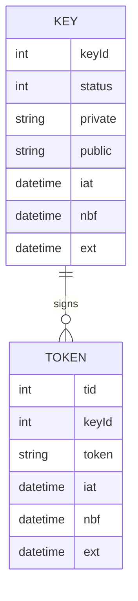

# Tables

KEYS - stores all active `key Pairs`. We assume ot have several active key pairs in case of rotation.

```mermaid
erDiagram
    KEY ||--o{ TOKEN : signs
    KEY {
        int keyId
        int status
        string private
        string public
        datetime iat 
        datetime nbf
        datetime ext
    }
    TOKEN {
        int tid
        int keyId
        string token
        datetime iat 
        datetime nbf
        datetime ext

    }

```